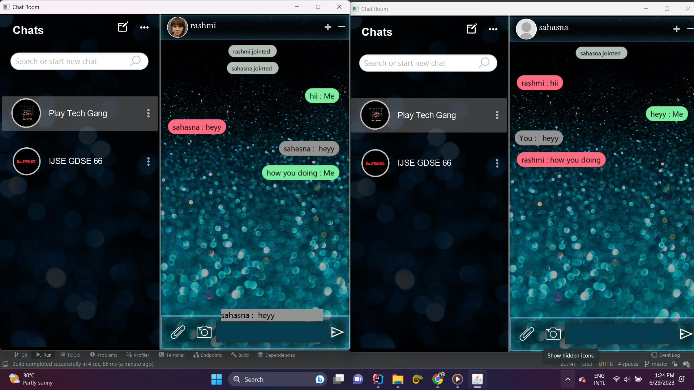

# Welcome to Play- Tech | Chat Application 💬📷😊
The application enables real-time communication between multiple users, supporting exchanging text, emojis, and images.

## Technology Stack:
- Core Technology: ✅ Java | Socket Programming
  
## Key Features:
- Multi-User Chat: Two or more users can chat at the same time in real-time.
- Text Messaging: Send and receive text messages instantly.
- Emoji Support: Users can express themselves with a variety of emojis.
- Image Sharing: Share images seamlessly during conversations.
  
## How It Works:

#### Server-Client Architecture:
- The chat application uses a socket programming model where a server handles multiple clients.
Each user connects to the server, which facilitates message broadcasting to all connected users.

#### Real-Time Communication:
- Messages, emojis, and images are sent instantly using socket streams, ensuring smooth and real-time communication.

- Screen will display all joined members

- Users can send messages 

- It shows the attachment file which contains emoji, gifs, and stickers

- User can send emojis 

- gifs 

- as well as stickers

- They can chat in Sinhala as well.

## Special Features

-  You can double-click on any text to choose that message specifically to send replies

- User can view all participants in the group 

- As well as change their background image 

