# Chat Application

Introduction To Network Programming module final project implement using socket programming.

Technology :-
✅Java socket programming

Functions :-

✅Two or more people can chat at the same time

✅Users can send text, emoji and images

## Features

- Firstly you can login to the by entering your and a image of yours if needed

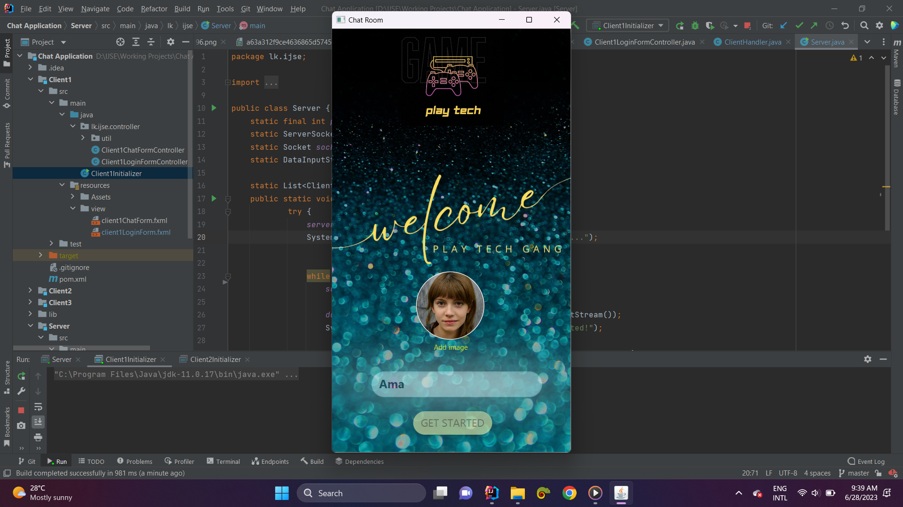

- Screen will display all jointed members

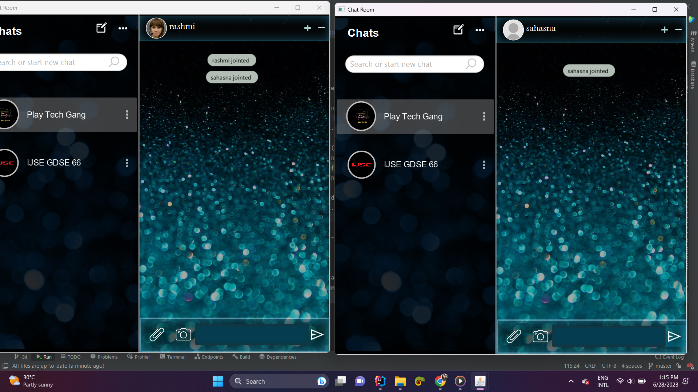

- Users can send messages 

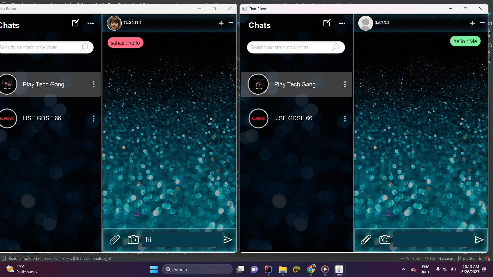

- It shows the attachment file which contains emoji, gifs and stickers

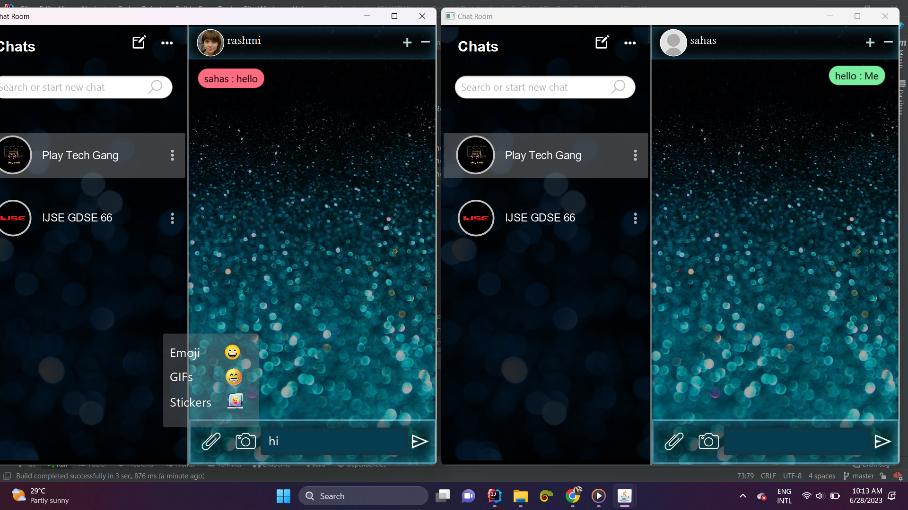

- User can send emojis 

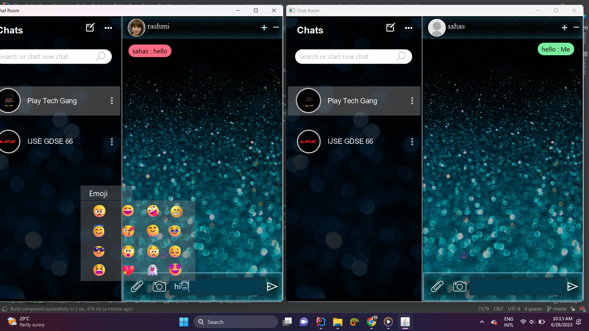

- gifs 

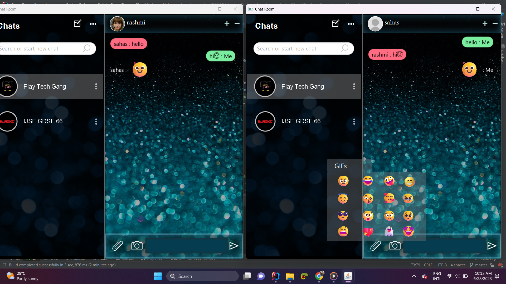

- as well as stickers

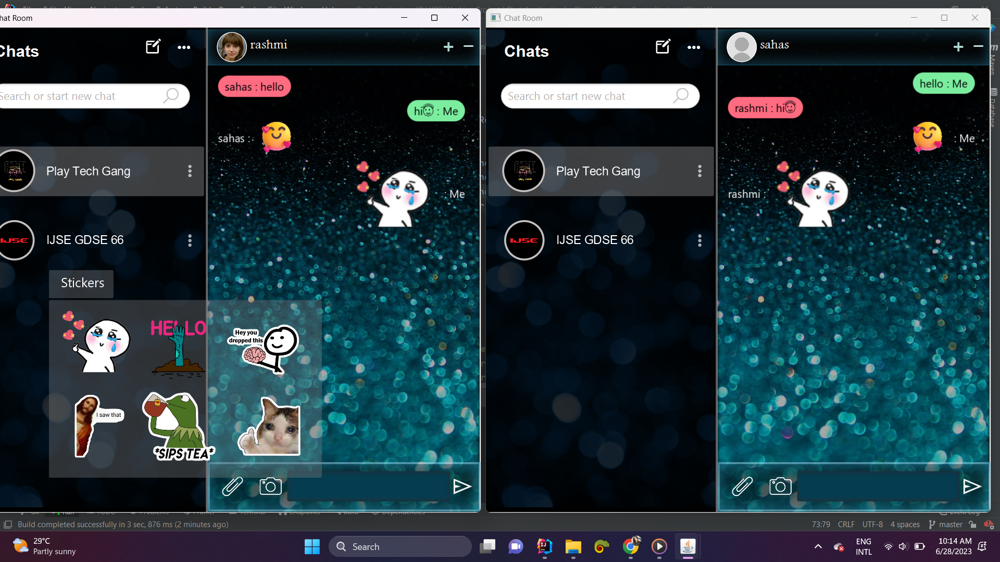

- They can chat in sinhala as well.

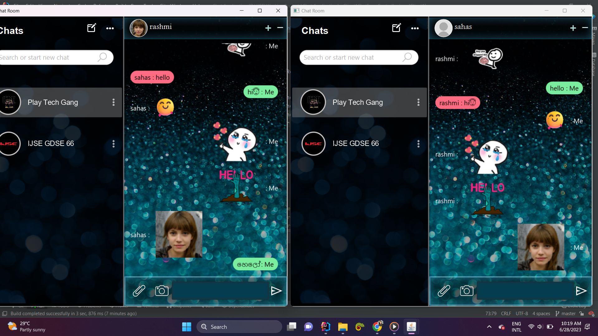

## Special Features

- User can view all participants in the group 

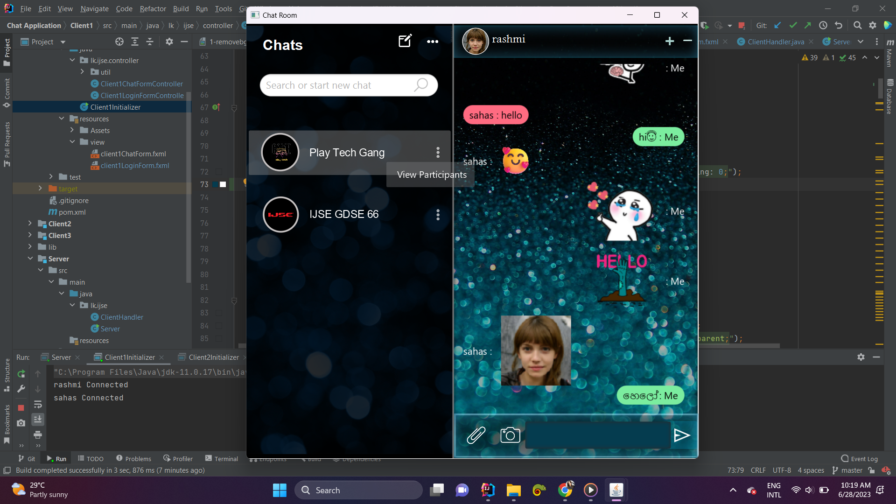

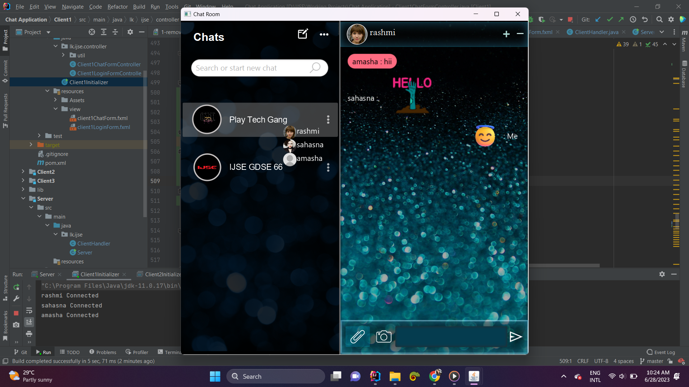

- As well as change their background image 

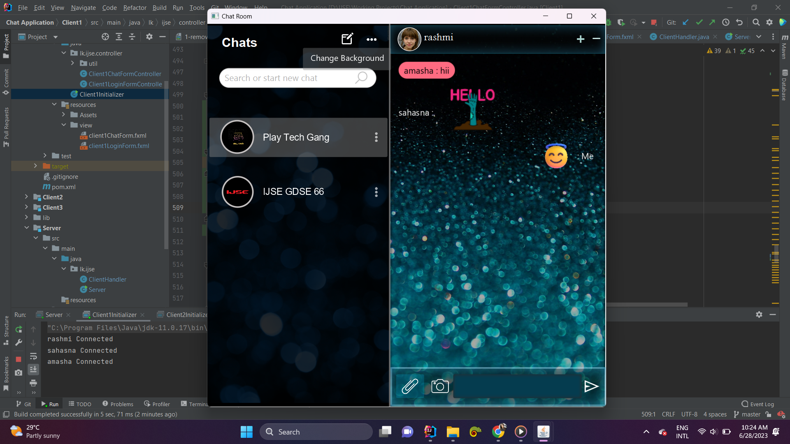

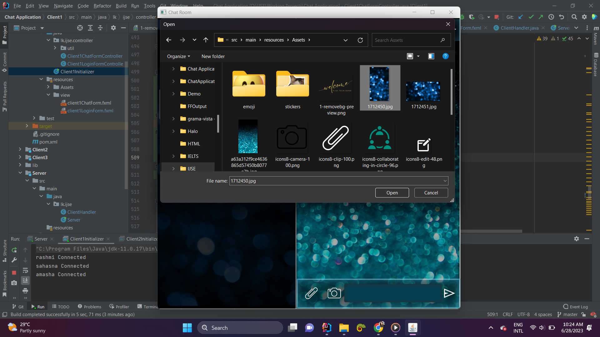

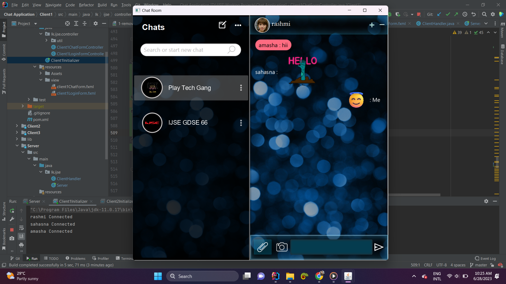
